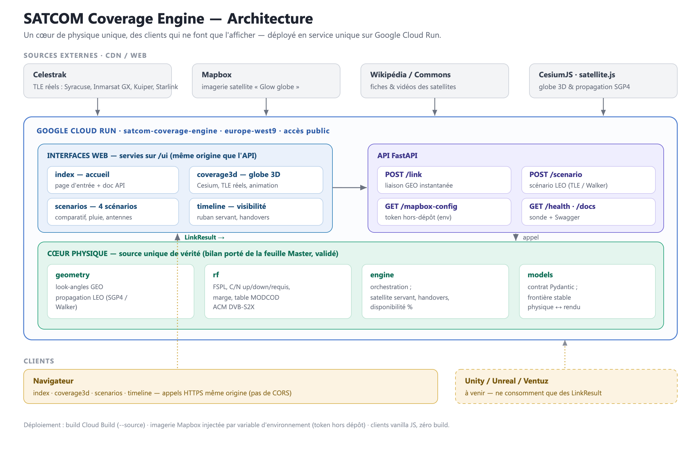

# SATCOM Coverage Engine

Moteur de planification de couverture **SATCOM (GEO + LEO)** et ses interfaces web, déployé
en service unique sur Google Cloud Run. Outil d'aide à l'avant-vente et à l'ingénierie liaison
pour le configurateur Thales / GetSAT.

**En ligne :** <https://satcom-coverage-engine-58899663812.europe-west9.run.app/>



---

## Sommaire

- [Principe](#principe)
- [Le moteur (API)](#1--le-moteur-de-calcul-fastapi)
- [Les interfaces web](#2--les-interfaces-web)
  - [Qualification](#21--qualification-briefhtml)
  - [Couverture 3D](#22--couverture-3d-coverage3dhtml)
  - [4 scénarios](#23--4-scénarios-scenarioshtml)
  - [Timeline](#24--timeline-timelinehtml)
- [Parcours & navigation](#3--parcours--navigation)
- [Déploiement](#4--déploiement)
- [Développement local](#5--développement-local)
- [Structure du projet](#6--structure-du-projet)
- [Données & sources](#7--données--sources-externes)
- [Hypothèses & limites](#8--hypothèses--limites)
- [Roadmap](#9--roadmap)

---

## Principe

Une idée centrale : **un cœur de physique unique (le moteur), des clients qui ne font que
l'afficher.** Le microservice calcule tous les bilans de liaison ; les interfaces web (et, à
terme, Unity / Unreal / Ventuz) ne consomment que des résultats normalisés (`LinkResult`) et
n'embarquent aucune physique. L'API **et** les interfaces sont servies par **une seule
application Cloud Run**, à la même origine (pas de CORS pour les clients servis).

---

## 1 · Le moteur de calcul (FastAPI)

Microservice Python, **source unique de vérité physique**. Bilan de liaison porté de la feuille
Master (GetSAT / Yahsat) et validé au centième près par des tests de non-régression (`pytest`).

### Endpoints

| Méthode | Route | Rôle |
|---|---|---|
| `GET`  | `/health` | sonde |
| `POST` | `/link` | **liaison GEO instantanée** (Syracuse, Inmarsat GX…) |
| `POST` | `/scenario` | **scénario LEO dynamique** (constellation Walker **ou** liste de TLE réels) |
| `GET`  | `/mapbox-config.json` | token / style Mapbox depuis les variables d'env (hors dépôt) |
| `GET`  | `/`, `/ui/…`, `/docs` | interfaces web + documentation API (Swagger) |

### Modules (`app/`)

| Fichier | Rôle |
|---|---|
| `geometry.py` | look-angles GEO (range / azimut / élévation) ; propagation LEO (SGP4 sur TLE, ou Walker) ; ECI/ECEF |
| `rf.py` | FSPL, C/N montant (SFD) & descendant (EIRP), combinaison C/N, C/N requis, marge, table MODCOD **ACM DVB-S2X** → débit utile |
| `engine.py` | orchestration : `compute_geo_link` (liaison GEO) ; `run_leo_scenario` (satellite servant par pas, **handovers**, **disponibilité %**) |
| `models.py` | contrat Pydantic — frontière stable physique ↔ rendu (`LinkRequest`, `ScenarioRequest`, `LinkResult`) |
| `main.py` | application FastAPI + service des interfaces statiques (`/ui`) + endpoint config Mapbox |

### Validation

`pytest -q` rejoue l'exemple Yahsat de la feuille Master (géométrie, FSPL, largeur de bruit,
C/N requis, monotonicité MODCOD) au centième près.

---

## 2 · Les interfaces web

Clients **vanilla JS, zéro build**, servis sur `/ui` (même origine que l'API). Tous pointent par
défaut sur le service Cloud Run.

### 2.1 · Qualification (`brief.html`)

Point d'entrée du workflow avant-vente. Transforme les **questions clés client** en estimation.

- **Pays de l'utilisateur final** : champ avec **autocomplétion** (72 pays, capitale + pluie par
  climat). Le pays choisi positionne toute l'analyse **et** la Couverture 3D.
- **Plateforme / mission** (aéroporté / maritime / terrestre, ISR / combat réseau / …), **bande**
  (L / Ku / Ka ou *à recommander*), **usage** (voix → vidéo HD) qui pré-remplit le débit,
  **contrainte d'antenne**, **infos satellite** (EIRP / G-T / SFD / back-off / longitude GEO) et **modem**.
- **Estimation live** (moteur) : bande retenue, **orbite recommandée** (GEO/LEO avec justification),
  **élévation GEO** de la zone, **marge pluie ITU-R P.618**, **antenne minimale** qui ferme le service
  (balayage `/link` sur 4 classes), **faisabilité**, **drapeau contrôle export**.
- **Aller-retour** : « Ouvrir dans la Couverture 3D » transmet le scénario ; le formulaire complet
  est **persisté (localStorage)** → retour avec l'ensemble des paramètres. Bouton **Réinitialiser**.

### 2.2 · Couverture 3D (`coverage3d.html`)

Globe **CesiumJS** piloté par des **TLE réels** (Celestrak). *Fichier généré* — voir
[Développement local](#5--développement-local).

- **Constellations** : Syracuse 4A/4B (GEO X), Inmarsat 5 / GX5 / 6 (GEO Ka), 364 Amazon Kuiper +
  ~400 Starlink (LEO Ka).
- **Terre photoréelle** : style Mapbox « Glow globe » (injecté par le serveur), repli Esri / Natural
  Earth garanti.
- **Couvertures** GEO/LEO en transparence + **bord lumineux façon Fresnel** ; **animation LEO** +
  **faisceau du satellite servant** + **handovers** (via `/scenario` sur les TLE).
- **Sélecteurs** : segment sol (6 sites + zone client), service LEO (Kuiper / Starlink) ; couches
  activables par type.
- **Puissance liaison (C/N reçu)** par type — décroît avec la latitude (élévation + dépointage faisceau).
- **Timeline moderne** : lecture/pause, coefficient de vitesse, sélecteur de date/heure
  (re-propagation), graphe scrubbable synchronisé.
- **Fiche satellite au clic** : **vidéo de la constellation** (zoomable 720p) + résumé Wikipédia,
  NORAD, désignation int., bande/orbite, altitude, inclinaison, période, vitesse, position/élévation live.
- **Bandeau « Scénario qualifié »** (depuis la Qualification) : repliable, **mis à jour** avec le
  segment/service, lien **← Qualification**.

### 2.3 · 4 scénarios (`scenarios.html`)

Tableau de bord comparatif : **4 services × 4 cas d'emploi** (route Europe, route Golfe, Ukraine
urbain dense, USV Méditerranée).

- Comparaison **Syracuse (GEO X) / Inmarsat GX (GEO Ka) / Amazon Leo / Starlink (LEO Ka)** : débit
  utile, masquage GEO, disponibilité & handovers LEO.
- **Élévation** + **atténuation pluie ITU-R P.618/P.838** réellement injectée dans le bilan.
- **Verdict** par scénario, et **matrice « antenne par service »** (voix / image / data /
  visioconférence / vidéo HD → plus petite classe d'antenne qui ferme, sinon LEO).

### 2.4 · Timeline (`timeline.html`)

Client léger : timeline LEO sur une fenêtre — ruban du satellite servant, handovers, courbe
d'élévation, infobulle (C/N, MODCOD, débit).

---

## 3 · Parcours & navigation

Menu commun centré sur toutes les pages : **Qualification | Couverture 3D | 4 scénarios**.

```
Qualification (pays + besoin) ──► estimation (bande / orbite / antenne / liaison)
        │  « Ouvrir dans la Couverture 3D »            ▲
        ▼                                              │ « ← Qualification » (form restauré)
Couverture 3D (globe, bandeau scénario, animation) ───┘
```

---

## 4 · Déploiement

- **Cloud Run** : projet `gen-lang-client-0804069470`, région Paris `europe-west9`, accès public.
- Build `gcloud run deploy --source .` (Cloud Build à partir du `Dockerfile`).
- Les interfaces sont **servies par l'API** (`/ui`) ; `/` redirige vers `/ui/`.
- **Imagerie Mapbox** injectée par variables d'environnement (token **jamais committé**) :

```bash
cd satcom_engine
gcloud run deploy satcom-coverage-engine --source . \
  --project gen-lang-client-0804069470 --region europe-west9 \
  --port 8080 --cpu 1 --memory 512Mi --min-instances 0 --max-instances 5 \
  --allow-unauthenticated \
  --set-env-vars "CORS_ORIGINS=*,MAPBOX_USER=mateoone,MAPBOX_STYLE=<style>,MAPBOX_TOKEN=<pk....>"
```

`deploy.sh` est fourni comme point de départ (ajuster projet / région / auth).

---

## 5 · Développement local

```bash
cd satcom_engine
python3 -m venv .venv && source .venv/bin/activate
pip install -r requirements.txt
pytest -q                                   # tests de non-régression

# serveur local (sert l'API + les interfaces sur http://localhost:8000/)
MAPBOX_TOKEN=<pk...> MAPBOX_USER=mateoone MAPBOX_STYLE=<style> \
  uvicorn app.main:app --host 127.0.0.1 --port 8000
```

Les clients étant servis depuis le disque, **un simple rafraîchissement** suffit après modif.

**Régénérer `coverage3d.html`** (fichier généré, avec TLE embarqués) :

```bash
python client/_gen/gen_coverage3d.py     # lit client/_gen/data/*.json -> client/coverage3d.html
```

Mettre à jour les TLE : remplacer les fichiers de `client/_gen/data/` (format JSON
`[{name,line1,line2}, …]`, depuis Celestrak) puis régénérer.

---

## 6 · Structure du projet

```
satcom_engine/
├── app/                  # moteur FastAPI (main, models, geometry, rf, engine)
├── client/               # interfaces servies sur /ui
│   ├── index.html        #   accueil
│   ├── brief.html        #   Qualification
│   ├── coverage3d.html   #   Couverture 3D (généré)
│   ├── scenarios.html    #   4 scénarios
│   ├── timeline.html     #   Timeline de visibilité
│   ├── media/            #   vidéos constellations (mp4)
│   └── _gen/             #   générateur de coverage3d + TLE (hors image)
│       ├── gen_coverage3d.py
│       └── data/*.json   #   Syracuse, GX, Kuiper, Starlink
├── tests/                # non-régression Yahsat
├── docs/                 # architecture (svg/png) + OVERVIEW (docx)
├── Dockerfile, requirements.txt, deploy.sh
└── README.md, OVERVIEW.md
```

---

## 7 · Données & sources externes

- **TLE** : Celestrak (Syracuse, Inmarsat-5/GX5/6, Kuiper, Starlink) — embarqués dans `client/_gen/data/`.
- **Imagerie** : Mapbox (style custom) avec repli Esri World Imagery / Natural Earth.
- **Fiches satellites** : API REST Wikipédia (CORS) + vidéos locales.
- **CDN** : CesiumJS, satellite.js.

---

## 8 · Hypothèses & limites

Illustratives et **clairement labellisées dans les pages** ; à confirmer par un bilan de liaison formel.

- Forme d'onde commune (porteuse par défaut, balayage ACM DVB-S2X).
- **Pluie** : ITU-R P.618/P.838 simplifié, R₀.₀₁ par région ; appliquée au bilan GEO via `rain_margin_db`.
- **Antennes** référencées Ka (Manpack 5 / Nano 10,8 / 0,6 m 15 / 1,0 m 19 dB/K) — le G/T réel varie avec la bande.
- **Puissance LEO** : le moteur applique une RF par défaut (EIRP 38 dBW, G/T 5) aux scénarios par TLE ;
  Kuiper et Starlink ne diffèrent que par la géométrie.
- TLE précis à quelques heures/jours de leur époque ; bandes L / Ku partiellement génériques.

---

## 9 · Roadmap

- Atténuation auto ITU-R P.618 (pluie) + P.676 (gaz) variable dans le temps en LEO.
- RF par constellation (EIRP / G-T propres à Kuiper / Starlink, Ku vs Ka).
- Arbitrage multi-orbite (meilleure liaison instantanée Syracuse / GX / LEO).
- Grille de couverture (EIRP/G-T par maille → contours carte).
- Catalogue terminaux GetSAT réels (G/T par produit et par bande) dans la matrice antenne.
