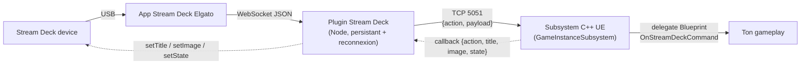

# Stream Deck ↔ Unreal Engine

Piloter des **events de gameplay Unreal** depuis un **Elgato Stream Deck** (éditeur PIE *et* build
packagé), et **renvoyer l'état du jeu vers les boutons** (titre / image / état). POC complet, testé,
inspiré de l'asset Unity *Stream Deck Integration* — mais côté UE.



- **Aller** (appui → UE) : le plugin envoie `{"action","payload"}` en TCP ; le subsystem fire le
  delegate Blueprint `OnStreamDeckCommand(Action, Payload)`.
- **Retour / callback** (UE → bouton) : à tout moment, UE appelle `SetButtonTitle/Image/State`
  pour mettre à jour **toutes les touches liées à cette action** (ex. surligner l'emplacement choisi).

---

## Pour le dev UE — 3 étapes

1. **Installer le plugin UE** : copier [`unreal-plugin/StreamDeckBridge/`](unreal-plugin/StreamDeckBridge)
   dans `TonProjet/Plugins/`, régénérer, compiler. Le serveur TCP démarre seul sur le port **5051**.
2. **Brancher ton gameplay** : récupérer le subsystem *Stream Deck Bridge*, lier l'event
   **On Stream Deck Command (Action, Payload)** et router avec un *Switch on String*.
   Exemple clé en main : [`examples/StreamDeckDemo`](examples/StreamDeckDemo).
3. **Pousser l'état vers les boutons** (callback) : appeler les fonctions ci-dessous quand l'état
   du jeu change.

### API du subsystem (`UStreamDeckBridgeSubsystem`)

| Fonction / event | Sens | Rôle |
|---|---|---|
| `OnStreamDeckCommand(Action, Payload)` | bouton → UE | delegate BlueprintAssignable, fired à chaque appui (game thread) |
| `IsClientConnected()` | — | un Stream Deck est-il connecté ? |
| `SetButtonTitle(Action, Title)` | UE → bouton | change le titre des touches liées à `Action` |
| `SetButtonImage(Action, ImageName)` | UE → bouton | change l'image (`"bt_03"` embarquée, ou data URI) |
| `SetButtonState(Action, StateIndex)` | UE → bouton | change l'état (actions multi-états) |
| `StartServer(Port)` / `StopServer()` | — | (re)démarrer le serveur TCP |

> Le routage UE→bouton se fait **par nom d'action** (UE ne connaît pas les touches individuelles) :
> un `SetButtonImage("Spin","bt_04")` met à jour toutes les touches configurées sur l'action `Spin`.

---

## Tester sans matériel / sans UE

| Besoin | Outil |
|---|---|
| Piloter UE **sans Stream Deck** | `printf '{"action":"Fire","payload":""}\n' \| nc 127.0.0.1 5051` |
| Vérifier le Stream Deck **sans UE** | `node tools/mock-ue/server.js` → http://localhost:8787 (voir le faux UE en live + tester le callback) |

Le **mock UE** ([tools/mock-ue](tools/mock-ue)) ouvre le même serveur TCP que le subsystem et
affiche les instructions reçues en temps réel, avec un panneau pour pousser titre/image/état.

---

## Installer le côté Stream Deck (plugin + profil)

Paquets prêts dans `dist/` (régénérables) :

```bash
./tools/build.sh           # -> .streamDeckPlugin + profil ALSTOM_MODULARITY_01 (19 touches, XL)
./tools/build.sh demo      # profil démo 5 boutons à la place
```

Le profil par défaut est **ALSTOM_MODULARITY_01** : 4 emplacements (`EMPLACEMENTA…D`) + 15 modules
(`MODULE1…MODULE15`). Les profils sont pilotés par des layouts dans `tools/profiles/<nom>/`.
Installation et mapping des touches : voir [INSTALL.md](INSTALL.md).

---

## Carte du dépôt

| Chemin | Quoi |
|---|---|
| [`unreal-plugin/StreamDeckBridge/`](unreal-plugin/StreamDeckBridge) | **plugin C++ UE** (subsystem TCP + delegate + callbacks) |
| [`examples/StreamDeckDemo/`](examples/StreamDeckDemo) | actor de démo (Color/Scale/Spin/Reset) + recette Blueprint |
| [`streamdeck-plugin/dev.mip.unreal.sdPlugin/`](streamdeck-plugin/dev.mip.unreal.sdPlugin) | **plugin Stream Deck** (Node : connexion persistante, callback, images) |
| [`tools/mock-ue/`](tools/mock-ue) | faux UE web pour vérifier les instructions reçues |
| [`tools/make_profile.js`](tools/make_profile.js) · [`tools/build.sh`](tools/build.sh) | génération des paquets `.streamDeckPlugin` / `.streamDeckProfile` |
| `dist/` | paquets construits (gitignoré) |

## Docs détaillées

- [HANDOFF.md](HANDOFF.md) — guide complet (pré-requis, install pas-à-pas, dépannage, *definition of done*).
- [PROTOCOL.md](PROTOCOL.md) — le contrat réseau (format des trames, callback, threading, sécurité).
- [INSTALL.md](INSTALL.md) — installer le plugin + le profil Stream Deck, mapping des touches.

## Roadmap

- [x] Aller bouton → UE (delegate Blueprint).
- [x] Connexion TCP persistante + reconnexion auto, mutualisée par `host:port`.
- [x] Callback UE → bouton (titre / image / état).
- [x] Profils MK.2 et XL avec images embarquées.
- [ ] Côté UE : accepter plusieurs clients simultanés (actuellement 1 à la fois).
- [ ] Dials (Stream Deck +) pour les valeurs analogiques.
